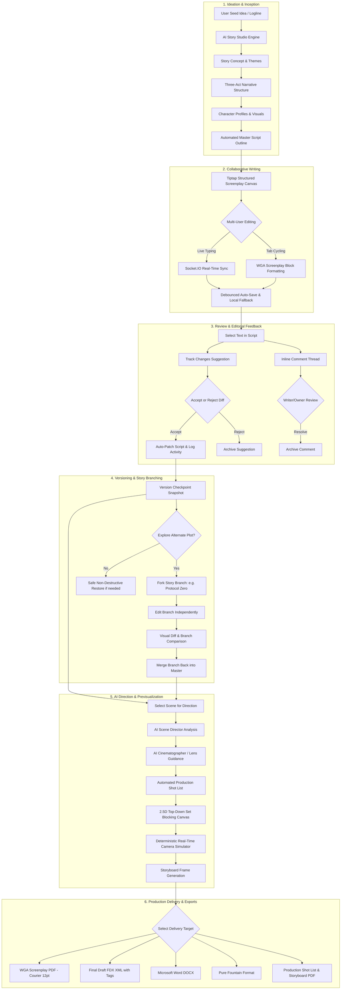
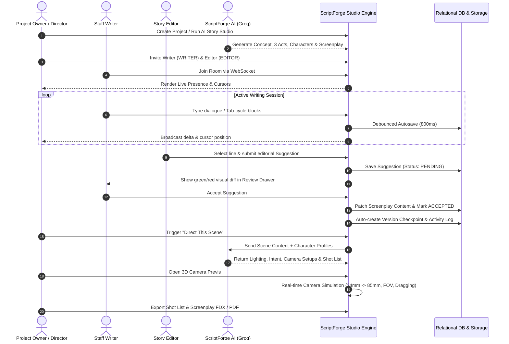
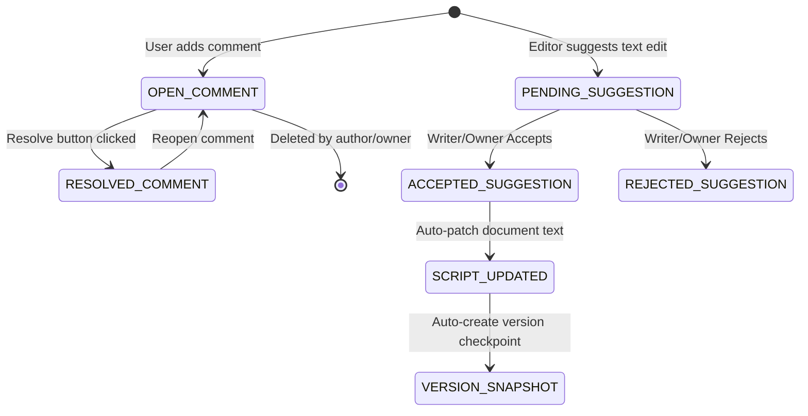
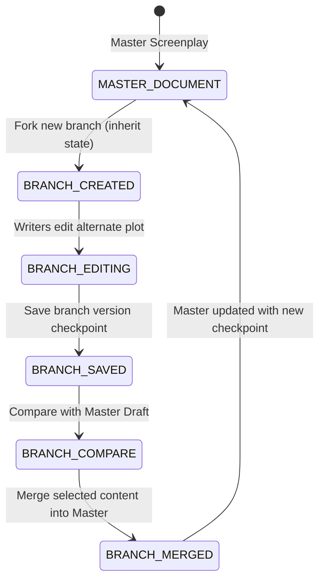

# ScriptForge: End-to-End Workflow Design & Architecture

ScriptForge transforms the traditional fragmented screenwriting process into a unified, real-time creative-to-production pipeline. This document defines the **system workflows**, **user journeys**, **role swimlanes**, and **data pipelines** that drive the platform.

---

## 1. Master Creative & Pre-Production Workflow

---

## 2. Multi-Role Collaboration Swimlane

ScriptForge enforces server-side Role-Based Access Control (RBAC) across **Owner**, **Writer**, **Editor**, and **Viewer**.

---

## 3. Stage-by-Stage Operational Specification

### Stage 1: Inception & AI Story Studio
1. **Input**: Logline or premise (e.g. *"A psychological sci-fi thriller about an isolated communications officer who intercepts a transmission predicting her crew's immediate deaths"*).
2. **AI Orchestration**:
   - Analyzes genre, tone, and audience demographics.
   - Deconstructs the narrative into **Act I (Setup & Catalyst)**, **Act II (Confrontation & Crisis)**, and **Act III (Resolution)**.
   - Builds complete **Character Profiles** with psychological traits and visual consistency descriptors (face, wardrobe, color palette).
   - Generates the initial **Master Screenplay Draft**.
3. **Transition**: Automatically creates the project and opens the writing workspace.

---

### Stage 2: Structured Screenplay Drafting & Live Collaboration
1. **Screenplay Engine**:
   - Strict block hierarchy: `Scene Heading` (`INT./EXT.`), `Action`, `Character`, `Dialogue`, `Parenthetical`, `Transition`.
   - **Tab Key Cycling**:
     - `Scene Heading` $\rightarrow$ `Action` $\rightarrow$ `Character` $\rightarrow$ `Dialogue` $\rightarrow$ `Parenthetical`.
     - `Shift + Tab` cycles in reverse.
   - Page estimation engine continuously computes screenplay running time ($1\text{ page} \approx 1\text{ minute} \approx 55\text{ lines}$).
2. **Real-Time Sync**:
   - Socket.IO rooms bind collaborators to `doc:<documentId>`.
   - Live presence avatars in header show active users, current scene locations, and colored cursors.
   - Conflict-resilient delta updates prevent overwriting.
3. **Autosave Pipeline**:
   - Debounced at 800ms to minimize database churn.
   - Displays real-time states: `Saving...` $\rightarrow$ `✓ Saved` $\rightarrow$ `Offline local fallback`.

---

### Stage 3: Editorial Feedback & Suggestions Engine
1. **Inline Comments**:
   - Highlighting any text opens the floating bubble menu $\rightarrow$ **Comment**.
   - Anchored with character offsets (`startPosition`, `endPosition`) and scene ID.
   - Threaded replies, timestamps, and `Resolve` / `Reopen` lifecycle.
2. **Track Changes Suggestions**:
   - Reviewers/Editors propose modifications without directly altering master text.
   - Highlights: **Green additions**, **Red strikethrough deletions**.
   - **Accept Action**: Instantly replaces the text in the master document, bumps the version number, and logs activity.
   - **Reject Action**: Dismisses the proposal while keeping audit trails.

---

### Stage 4: Version Control & Story Branching
1. **Version History**:
   - Checkpoints triggered manually or automatically upon major editorial actions.
   - Side-by-side **Visual Diff Viewer** (`Previous Version` vs. `Current Version`).
   - **Safe Non-Destructive Restore**: Restoring an earlier draft creates a **new** version (e.g. `Version 25: Restored from Version 21`), ensuring no historical work is ever lost.
2. **Story Branching System**:
   - Create alternate storylines (e.g. *"Branch A: Maya stays on station"*, *"Branch B: Protocol Zero"*).
   - Visual Story Tree UI displays active branch state.
   - Isolated branch editing $\rightarrow$ **Compare Branches** $\rightarrow$ **Merge Branch into Main**.

---

### Stage 5: Cinematic Previsualization & AI Directing
1. **AI Scene Director**:
   - Generates scene intent, subtext, lighting color temperatures, practical lights, and soundscapes.
2. **AI Cinematographer**:
   - Provides DP advice on focal lengths, depth of field, and camera movement (e.g. *Push-in on Dana dolly*).
3. **Interactive Set Blocking (2.5D Floor Plan)**:
   - Draggable actors, camera frustums, and furniture/props.
4. **Deterministic Camera Simulation**:
   - Perspective viewport runs in real-time in the browser.
   - Instant focal length adjustments (`24mm`, `35mm`, `50mm`, `85mm`, `135mm`) with zero network latency.
5. **Storyboard Frame Generation**:
   - Structured JSON prompt synthesis (`shot`, `lens`, `lighting`, `mood`, `character visual profile`, `environment`) fed into image providers.

---

### Stage 6: Production Planning & Exports
1. **Screenplay PDF**: Industry-standard Courier 12pt format, exact WGA margins (left 1.5", right 1.0"), title page, and page numbers.
2. **Final Draft (FDX XML)**: Valid structural XML with native `<SceneHeading>`, `<Action>`, `<Character>`, `<Dialogue>` tags.
3. **Microsoft Word (DOCX)**: Styled document for table reads and production annotations.
4. **Fountain**: Clean plain-text markup for specialized mobile and desktop apps.
5. **Shot List & Storyboard PDF**: Production table for directors, camera operators, and 1st ADs on set.

---

## 4. State Transition Diagrams

### Comment & Suggestion Lifecycle

### Story Branch Lifecycle

---

## 5. Summary of System Benefits

- **Zero Context Switching**: Writers draft, directors block scenes, and editors leave notes in a single unified workspace.
- **Data Safety**: Debounced autosaving, non-destructive version restores, and branch isolation eliminate lost work.
- **Fast Execution**: Real-time camera simulator runs deterministically in the client, reserving Groq AI for deep creative reasoning and structured planning.
